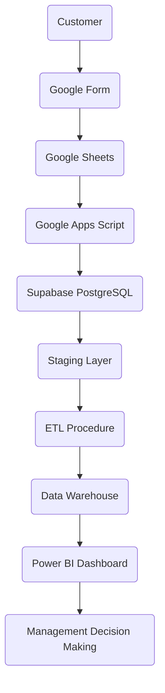
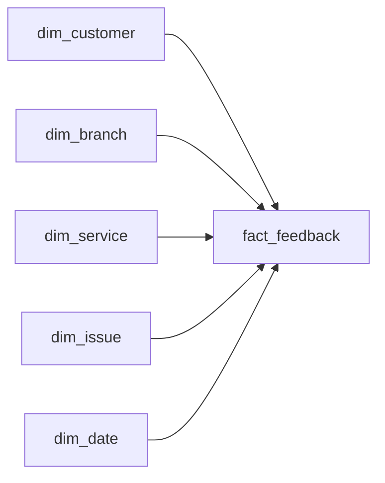

<!-- ===================================================== -->
<!-- PROJECT BANNER -->
<!-- ===================================================== -->

<h1 align="center">
🏦 CoreTrust Bank Customer Feedback & Risk Analytics Platform
</h1>

<p align="center">
An End-to-End Business Intelligence Solution built with
<b>Google Forms</b>,
<b>Google Apps Script</b>,
<b>Supabase PostgreSQL</b>,
<b>SQL</b>,
<b>ETL</b>,
<b>Data Warehousing</b>
and
<b>Power BI</b>.
</p>

<p align="center">


</p>

---

# 📚 Table of Contents

- [Project Overview](#-project-overview)
- [Business Problem](#-business-problem)
- [Business Objectives](#-business-objectives)
- [Technology Stack](#-technology-stack)
- [System Architecture](#-system-architecture)
- [ETL Pipeline](#-etl-pipeline)
- [Database Design](#-database-design)
- [Star Schema](#-star-schema)
- [Power BI Dashboard](#-power-bi-dashboard)
- [Key Performance Indicators](#-key-performance-indicators)
- [Results](#-results)
- [Repository Structure](#-repository-structure)
- [Future Improvements](#-future-improvements)

---

# 📖 Project Overview

> **CoreTrust Bank is a fictional bank created solely for educational and portfolio purposes.**

This project demonstrates the design and implementation of a complete **Business Intelligence (BI)** solution for a banking environment.

The system automates the entire customer feedback lifecycle from collecting responses through Google Forms to delivering executive dashboards in Microsoft Power BI.

Instead of relying on spreadsheets and manual reporting, customer feedback is automatically processed through an ETL pipeline, stored in a cloud-hosted PostgreSQL database, transformed into a dimensional warehouse and visualized through interactive dashboards that support business decision-making.

---

# ❗ Business Problem

Banks receive valuable customer feedback every day.

However, many organizations still experience problems such as:

- Manual spreadsheet reporting
- Slow report generation
- Decentralized customer data
- Difficulty identifying high-risk customer experiences
- Limited visibility into branch performance
- Time-consuming data preparation

Without an automated analytics platform, management spends more time preparing reports than analysing customer satisfaction.

---

# 🎯 Business Objectives

The objective of this project was to build a fully automated Business Intelligence solution capable of:

✅ Collecting customer feedback digitally

✅ Automating ETL

✅ Eliminating manual reporting

✅ Building a cloud database

✅ Creating a dimensional warehouse

✅ Delivering executive dashboards

✅ Monitoring operational risk

✅ Supporting data-driven decision making

---

# 🛠 Technology Stack

| Technology | Purpose |
|------------|----------|
| Google Forms | Customer feedback collection |
| Google Sheets | Temporary staging |
| Google Apps Script | ETL automation |
| REST API | Data transfer |
| PostgreSQL | Database |
| Supabase | Cloud hosting |
| SQL | Database development |
| PL/pgSQL | Stored Procedures |
| Star Schema | Data warehouse |
| Power BI | Dashboard |
| DAX | Business calculations |
| ODBC | Database connectivity |

---

# 🏗 System Architecture



---

# 🔄 ETL Pipeline

The solution follows the traditional ETL methodology.

## Extract

Customer submits feedback.

↓

Google Forms stores the response.

↓

Google Apps Script extracts the latest submission.

---

## Transform

Apps Script performs:

- Data validation
- Risk Score calculation
- Risk Level assignment
- JSON generation
- Data formatting

---

## Load

Processed data is sent to Supabase using the REST API.

The warehouse ETL procedure then:

- Loads dimensions
- Loads the fact table
- Prevents duplicates
- Marks processed records

---

# 🗄 Database Design

The solution uses a layered architecture.

### Staging

```
staging.customer_feedback_raw
```

Stores raw operational data.

---

### Warehouse

Dimension Tables

- dim_customer
- dim_branch
- dim_service
- dim_issue
- dim_date

Fact Table

- fact_feedback

---

# ⭐ Star Schema



---

# 📊 Power BI Dashboard

## Executive Overview

📌 KPI Cards

📌 Feedback by Branch

📌 Feedback by Service

📌 Risk Level Distribution

📌 Issue Category Distribution

📌 Interactive Slicers

---

## Customer Insights

📌 Monthly Feedback Trend

📌 Average Rating by Branch

📌 Average Risk Score by Branch

📌 Detailed Feedback Table

---

# 📷 Dashboard Preview

<h2>📊 Executive Overview Dashboard</h2>


<h2>📈 Customer Insights & Operational Trends</h2>


---

# 📈 Key Performance Indicators

The dashboard automatically calculates:

- Total Feedback

- Average Rating

- Average Risk Score

- High Risk Feedback

- Low Risk Feedback

- Feedback by Branch

- Feedback by Service

- Feedback by Issue Category

---

# ✅ Results

The project successfully achieved the following outcomes:

✔ Automated customer feedback collection

✔ Automated ETL pipeline

✔ Cloud-hosted PostgreSQL database

✔ Star Schema data warehouse

✔ SQL stored procedures

✔ Warehouse automation using triggers

✔ Executive Power BI dashboards

✔ Interactive business reporting

---

# 📂 Repository Structure

```
CoreTrust-Bank-Customer-Feedback-Analytics/

│

├── README.md

├── Architecture Diagram/

├── sql/

├── apps-script/

└── powerbi/
```

---

# 🛠 Challenges & Solutions

Throughout the development of this project, several technical challenges were encountered. Each issue provided an opportunity to improve the overall solution and strengthen the reliability of the ETL pipeline.

| Challenge | Solution |
|-----------|----------|
| Google Apps Script authorization and permissions prevented the automation from running initially. | Configured the required Google permissions, authorized the script, and verified successful execution through the Apps Script editor. |
| Ensuring reliable data transfer from Google Forms to the cloud database. | Developed an automated ETL process using Google Apps Script to validate, transform, and send data to Supabase through the REST API. |
| Preventing duplicate records during warehouse loading. | Implemented SQL `NOT EXISTS` checks within the ETL stored procedure to ensure each submission was loaded only once. |
| Keeping track of processed and unprocessed records. | Added `processed` and `processed_at` fields to the staging table and updated them automatically after successful warehouse loading. |
| Designing an efficient analytical database structure. | Implemented a Star Schema consisting of dimension tables and a centralized fact table to improve query performance and simplify reporting. |
| Connecting Power BI to Supabase. | Installed the PostgreSQL ODBC driver, configured the connection correctly, and resolved SSL certificate and connectivity issues. |
| Power BI refresh failures caused by cyclic reference errors. | Identified and removed problematic relationships and refreshed the data model successfully. |
| Automating warehouse population. | Created a PostgreSQL stored procedure and trigger to automatically load dimension and fact tables whenever new staging records were inserted. |
| Maintaining consistent dashboard metrics. | Developed DAX measures to calculate KPIs dynamically, ensuring dashboards reflected the latest warehouse data after refresh. |
| Creating a professional dashboard layout. | Applied a modern dark-themed design with KPI cards, interactive slicers, navigation, and responsive visual placement for improved usability. |

---

### Key Lessons Learned

This project strengthened practical experience in:

- Designing and implementing ETL pipelines.
- PostgreSQL database development and SQL optimization.
- Star Schema dimensional modelling.
- Cloud database deployment with Supabase.
- Google Apps Script automation.
- REST API integration.
- Power BI dashboard development.
- DAX measure creation.
- Data warehouse automation using stored procedures and triggers.
- Troubleshooting real-world data integration and reporting issues.

# 🔮 Future Improvements

- Scheduled Power BI refresh

- Power BI Service deployment

- Role-based security

- Email notifications

- Machine Learning

- Azure deployment

- Real-time dashboards

---

# 👨‍💻 Author

**Thabang Evans Pholo**

Business Intelligence • Data Analytics • SQL • PostgreSQL • Power BI • ETL • Data Warehousing

---
